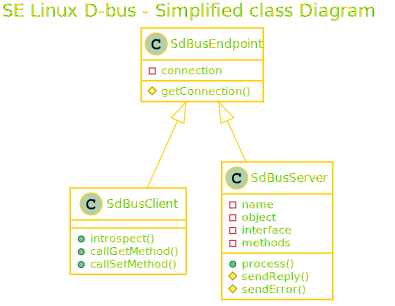
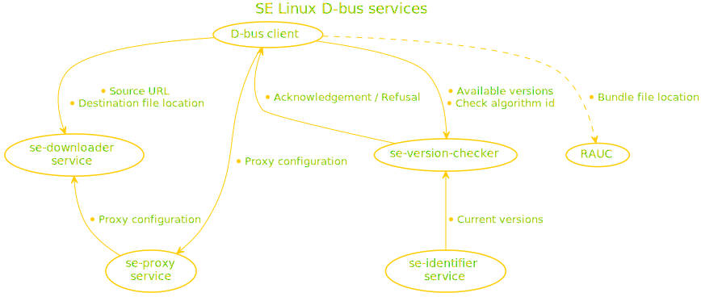

# [SE Linux d-bus services](https://se-deviceintelligence.github.io/se-dbus/)

[](https://github.com/SE-DeviceIntelligence/se-dbus/actions/workflows/clang-tidy.yml) [](https://github.com/SE-DeviceIntelligence/se-dbus/actions/workflows/cppcheck.yml) [](https://github.com/SE-DeviceIntelligence/se-dbus/actions/workflows/cpplint.yml) [](https://github.com/SE-DeviceIntelligence/se-dbus/actions/workflows/doxygen.yml) [](https://github.com/SE-DeviceIntelligence/se-dbus/actions/workflows/gtest.yml) [](https://github.com/SE-DeviceIntelligence/se-dbus/actions/workflows/iotat-gtest.yml) [](https://github.com/SE-DeviceIntelligence/se-dbus/actions/workflows/lizard.yml) [](https://github.com/SE-DeviceIntelligence/se-dbus/actions/workflows/vera++.yml)

[](https://github.com/SE-DeviceIntelligence/se-dbus/actions/workflows/klocwork.yml)

[](https://mit-license.org/)

D-bus client/server classes based on sd-bus library

# Table of contents

* [Classes](#classes)
* [Clone](#clone)
* [Build](#build)
* [Test](#test)
* [Analyze](#analyze)
* [Document](#document)
* [Services](#services)

# Classes


* SdBusEndpoint reserves sd-bus system connection for client & server
* SdBusClient provides introspection of any object and calls to any simple get/set methods
  * SdBusClient might be extended to call more complex methods and/or introspect a specific object by default
* SdBusServer handles object identification and processes its methods
  * SdBusServer might be extended to encapsulate identification setup and methods implementation

# Clone
````
git clone git@github.com:SE-DeviceIntelligence/se-dbus.git
````

# Build
## Pre-requisite
````
sudo apt update && sudo apt -y install libsystemd-dev
````

## Release
````
mkdir build
cd build
cmake ..
make
````
alternatively
````
./build-release.sh
````

## Debug
````
mkdir build
cd build
cmake -DCMAKE_BUILD_TYPE=debug ..
make
````
alternatively
````
./build-debug.sh
````

# Test

## GTest suite
````
cp conf/com.se.Test1.conf /etc/dbus-1/system.d/
mkdir build
cd build
cmake -DCMAKE_BUILD_TYPE=coverage -DTEST=on ..
make
cd test
sudo ./se-sdbus-test
gcovr .  --exclude-directories googletest-build -r ../../.. --html --html-details -o index.html
rm /etc/dbus-1/system.d/com.se.Test1.conf
firefox index.html &
````
alternatively
````
cp conf/com.se.Test1.conf /etc/dbus-1/system.d/
./build-coverage.sh
sudo ./coverage-html.sh se-sdbus-test
rm /etc/dbus-1/system.d/com.se.Test1.conf
firefox build/coverage/test/index.html &
````

## Demo client/server
Client and server built in debug mode will display many messages while in release mode they will only return 0 on success or -1 on error

Client will call set method from server with user payload then get method to compare both payloads

### Start server
````
./build/debug/se-dbus-test-server &
````

### Run client
````
./build/debug/se-dbus-test-client [-p somePayload]

Acquire connection: 0x56121f467f00
Call set method: SetTest([-p somePayload]) >>> /com/se/Test1 @ com.se.Test1 / com.se.Test1.Testable
Call get method: GetTest() >>> /com/se/Test1 @ com.se.Test1 / com.se.Test1.Testable
GetTest received [-p somePayload]
Release connection: 0x56121f467f00
````

## Demo firmware update through services
On Yocto Linux with integrated services, the user can test the following through DBus using busctl tool :
* Set Curl and Docker proxy
* Check installed version
* Check updatability with a proposed new version
* Download update bundle
* Install bundle with RAUC

To generate the production Image with a specific SW version (for example: 001.001.001), run this command:

```sh
export FW_REV="001.001.001"
export BB_ENV_EXTRAWHITE="$BB_ENV_EXTRAWHITE FW_REV"
bitbake prod-image
```

To generate the bundle containing the production Image with a different SW version (for example: 001.001.002), run this command:

```sh
export FW_REV="001.001.002"
export BB_ENV_EXTRAWHITE="$BB_ENV_EXTRAWHITE FW_REV"
bitbake prod-image-bundle
```

```
#### Proxy configuration
## Curl
# Set Curl proxy
busctl call com.se.Proxy1 /com/se/Proxy1 com.se.Proxy1.Proxiable SetCurlProxy ssqsssss "http" "gateway.schneider.zscaler.net" 80 "" "" "" "" "localhost,127.0.0.1,se.com,.se.com,schneider-electric.com,.schneider-electric.com"

# Check Curl proxy config
busctl call com.se.Proxy1 /com/se/Proxy1 com.se.Proxy1.Proxiable GetCurlProxy

# Show .curlrc configuration on filesystem
cat /data/se-proxy/.curlrc

# Delete Curl proxy config (not needed for local test)
busctl call com.se.Proxy1 /com/se/Proxy1 com.se.Proxy1.Proxiable DeleteCurlProxy

# Check Curl proxy config
busctl call com.se.Proxy1 /com/se/Proxy1 com.se.Proxy1.Proxiable GetCurlProxy

## Docker
# Show current Docker service Environment variables
systemctl show -p Environment docker.service --no-pager

# Set Docker proxy conf
busctl call com.se.Proxy1 /com/se/Proxy1 com.se.Proxy1.Proxiable SetDockerProxy ssqssssqsssy "http" "gateway.schneider.zscaler.net" 80 "" "" "http" "gateway.schneider.zscaler.net" 80 "" "" "localhost,127.0.0.1,se.com,.se.com,schneider-electric.com,.schneider-electric.com" 0

# Check set proxy in Docker service Environment variables
systemctl show -p Environment docker.service --no-pager

### SW version and update ####
# Get current SW version
busctl call com.se.Identifier1 /com/se/Identifier1 com.se.Identifier1.Identifiable GetSoftwareVersion

# Check if can download version 001.001.002
busctl call com.se.VersionChecker1 /com/se/VersionChecker1 com.se.VersionChecker1.Versionable CheckVersion ss "001.001.002" "greater"

# Prepare download location (= /tmp/sdcard)
mkdir -p /tmp/sdcard && mount /dev/mmcblk0p2 /tmp/sdcard

# Download bundle to /tmp/sdcard/tmp/
busctl --timeout=1min call com.se.Downloader1 /com/se/Downloader1 com.se.Downloader1.Downloadable Download ss "/tmp/sdcard/tmp/prod-image-bundle-rzn1d400-bestla-20211125145813.raucb" "http://10.10.32.1/prod-image-bundle-rzn1d400-bestla-20211125145813.raucb"

# Install bundle with RAUC
busctl call de.pengutronix.rauc / de.pengutronix.rauc.Installer InstallBundle sa{sv} /tmp/sdcard/tmp/prod-image-bundle-rzn1d400-bestla-20211125145813.raucb 0

# Check RAUC install progress
busctl get-property de.pengutronix.rauc / de.pengutronix.rauc.Installer Progress

# Reboot after install
sync && reboot

# Get new SW version
busctl call com.se.Identifier1 /com/se/Identifier1 com.se.Identifier1.Identifiable GetSoftwareVersion
```

# Analyze
## Lizard
````
./analyze-lizard.sh
````

## Vera++
````
./analyze-vera++.sh */*.h */*.cpp
````

## CppLint
````
./analyze-cpplint.sh */*.h */*.cpp
````

## CppCheck
````
./analyze-cppcheck.sh
````

## Clang-Tidy
````
./analyze-clang-tidy.sh
````

## Klocwork
````
./analyze-klocwork.sh se-dbus
````

# Document
````
./doc-doxygen.sh
firefox build/doc/html/index.html &
````

# Services



## [Identifier service](https://se-deviceintelligence.github.io/se-dbus-identifier/)
## [Version checker service](https://se-deviceintelligence.github.io/se-dbus-version-checker/)
## [Proxy service](https://se-deviceintelligence.github.io/se-dbus-proxy/)
## [Downloader service](https://se-deviceintelligence.github.io/se-dbus-downloader/)
